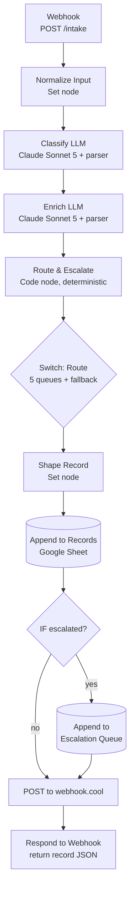

# ArcVault Intake & Triage: Architecture Write-Up (deliverable 4.4)

## 1. System design

An inbound message enters through an n8n **Webhook** and flows through a stateless pipeline; the only persistent state is the Google Sheet at the end.

**What triggers what.** A POST to `/intake` starts one execution per message. `Normalize` supplies defaults for the optional fields (id, source, receivedAt, run flags); `rawMessage` is the one required input. **Classify** (LLM) assigns category/priority/confidence; **Enrich** (LLM) extracts entities, urgency, billing amounts, and a team summary. **Route & Escalate** (a single Code node) applies deterministic business rules. The **Switch** makes the routing branches visible on the canvas; all branches converge to persist. Every record is appended to the **Records** sheet, escalated ones additionally to the **Escalation Queue** sheet, then POSTed to a [webhook.cool](http://webhook.cool/) request bin that stands in for a ticketing system, and finally returned to the caller.

**The verbatim customer message rides along.** Each record carries `rawMessage` (the original text, untouched) beside the AI-derived fields. The classification/enrichment are a lossy interpretation; keeping the source attached lets the receiving queue owner (or a second-pass reviewer) sanity-check the label against what the customer actually wrote, rather than trusting the summary alone. It costs nothing (a passthrough field) and mirrors how real ticketing systems always retain the original body.

**Where state lives.** The workflow is **stateless**: no execution reads anything written by a previous one. All durable state is the Google Sheet (two tabs); the downstream POST hands off to whatever real system would own the ticket. This makes the workflow horizontally scalable. It is not, however, idempotent or fully deterministic: the LLM steps are sampled, the record carries a `processedAt` timestamp, and the Sheets append is a side effect, so a retry today would double-append rows. Safe retries need the idempotency keys discussed in §4.

**Why n8n.** The assignment recommends it, and for a triage pipeline the visual canvas *is* documentation: routing and escalation branches are self-evident to a reviewer, which matters more here than raw code flexibility. It also gave first-class LLM chain + structured-output-parser nodes and native Google Sheets / HTTP nodes, so the whole thing is ~2 code touchpoints instead of a service to deploy.

**Why Anthropic `claude-sonnet-5`.** Strong instruction-following and reliable strict JSON via the structured-output parser, which both LLM chains depend on. The workflow originally targeted Groq's free-tier `llama-3.3-70b-versatile`, but Groq's free-tier token-per-minute/day limits couldn't sustain the two-LLM-call-per-message pattern under repeated test runs, so the chat-model node was swapped to Anthropic Sonnet 5 (same prompts, same parsers, only the model node changed). Sonnet 5 rejects non-default sampling parameters (`temperature`, `top_p`, `top_k` each return a 400), so temperature cannot be pinned to 0; the determinism the parsers need comes from the prompt and the output schema instead. Ollama remains the documented local fallback if API access is unavailable, though a small local model classifies noticeably worse, so it's fallback-only.

## 2. Routing logic

Routing is a deterministic category-to-queue map (always computed as `suggestedQueue`):

| Category | Queue | Why |
|----------|-------|-----|
| Bug Report | Engineering | Engineers own defects |
| Incident/Outage | Engineering | Same responders, but always escalated (below) |
| Feature Request | Product | Product owns the roadmap |
| Billing Issue | Billing | Finance/billing ops |
| Technical Question | IT/Security | ArcVault's technical questions here are auth/SSO/integration, an IT/Security domain |

`suggestedQueue` is **always populated**. On escalation the delivered `queue` is overridden to **"Escalation / Human Review"**, but `suggestedQueue` is preserved so the human reviewer sees where it would otherwise have gone. The **fallback for low confidence** is part of the escalation logic below: an unsure classification is never trusted to auto-route; it goes to a human. A category outside the five above maps to human review too, though it lands there unflagged, since no escalation rule fired. The classifier's structured-output schema constrains the category to that enum, so this is a backstop rather than a live path.

## 3. Escalation logic

Escalation is deterministic code (not the LLM), so the rules are auditable, unit-testable, and cheap. Five rules, each appends a human-readable reason; any one firing sets `escalated: true` and overrides the queue:

0. **Unparseable LLM output**: both chains run with `onError: continueRegularOutput`, so a model error or a Structured Output Parser failure reaches the Code node as an item with no `output` key. Rather than crash or emit a record with silent nulls, the item is flagged and sent to human review (`fallbackUsed: true`). A record we cannot trust is one a human should see; dropping it is the worse failure.
1. **Confidence < 0.70** triggers the low-confidence fallback (`fallbackUsed: true`). An unsure classification gets human eyes. Suppressed when classification failed, so a failed classification does not report a fabricated confidence of 0.
2. **Literal keyword**: message contains `outage` or `down for all users` (case-insensitive). Kept intentionally minimal: a deterministic backstop for the exact compliance phrases in the brief. Semantic outage detection is the classifier's job (rule 4), not a keyword list.
3. **Billing discrepancy > $500**: `|charged - contract|`, computed in the Code node from the two amounts the LLM extracted. The LLM never does arithmetic.
4. **Category = Incident/Outage**: always escalate.

**Why deterministic.** These are business/compliance rules; they must be correct and explainable, not probabilistic. The routing/escalation Code node is covered by a 38-assertion unit test (`scripts/test-route-node.mjs`, which extracts the node's actual code from the workflow JSON and runs it against mocked inputs) exercising every rule, both boundaries, and the degraded-LLM paths.

**Threshold interpretations (and the intentional non-escalations).**
- "billing error > $500" = `|charged - contract| > $500`. **msg-003** has charged 1240 vs contract 980, a delta of **260**, which is **below** $500, so it is correctly **NOT** escalated. This is deliberate and demonstrates the boundary.
- Boundaries are strict: confidence exactly 0.70 does **not** escalate (`< 0.70`); delta exactly 500 does **not** escalate (`> 500`).
- **msg-005** (the outage) has **no literal keyword**; it escalates via rule 4 (category). This proves escalation keys off classification, not string-matching.
- **msg-006** (synthetic demo) is genuinely ambiguous; the model reports 0.45 confidence, so rule 1 fires, demonstrating the low-confidence fallback live. Its `suggestedQueue` still records **Billing**, so the human reviewer inherits the model's best guess rather than a blank.

A note on `urgencySignal` vs `priority`: they are independent by design. `priority` is the business rubric (a 403 lockout is High); `urgencySignal` is the model's read of the sender's tone (a calm lockout email can read "medium"). They are not meant to agree.

## 4. What I'd do differently at production scale

- **Reliability:** put a real queue (SQS/PubSub) between ingestion and processing with retries + a dead-letter queue; add **idempotency keys** (message id) so retries don't double-write; wrap the LLM calls in retry-with-backoff. Escalation rule 0 already routes a failed LLM call to human review rather than dropping the message, but it cannot distinguish a transient 429 (retry) from a malformed completion (escalate); a production version would. Persist to a database with the Sheet as a view, not the system of record.
- **Cost:** classification is the hot path: a **smaller/cheaper model** (or a distilled classifier) handles the easy 80%, escalating only uncertain cases to the large model (a router/cascade). A **local Ollama model** could sit at the front of that cascade, running free on owned hardware to classify the easy, high-confidence cases and only paying for the hosted API when Ollama's own confidence is low; this cuts per-message API cost at the expense of hosting/maintaining the local model and its lower baseline accuracy. **Cache** identical or near-identical messages. Batch enrichment.
- **Latency:** entity extraction could run **in parallel** with classification (the enrich prompt currently takes the category as context, but extracting identifiers/amounts doesn't require it; the category-aware summary can be a cheap final step), or collapse to a single combined call when latency matters more than prompt isolation. The two-call design trades ~2x latency for cleaner prompts and failure isolation.
- **Observability:** trace every step (input, prompt, output, latency, cost) to a store; build a **labeled eval set** and track category accuracy + **confidence calibration** over time (are 0.7-confidence predictions right ~70%?); alert on category-distribution drift and rising escalation rate.

## 5. Phase 2 (another week)

- **Human-correction feedback loop:** when a reviewer re-queues a misrouted ticket, capture (message, corrected label) into the eval set and use it for few-shot selection / fine-tuning; the system learns from its mistakes. A memory layer like [Supermemory](https://github.com/supermemoryai/supermemory) is a natural fit for storing these corrections and retrieving similar past corrections at classification time as few-shot context (RAG over corrections, not model retraining) so recurring misclassification patterns get corrected context automatically instead of waiting on a periodic eval-set review.
- **RAG over the knowledge base + past tickets:** enrich each message with the customer's account/plan and similar resolved tickets, and generate a **draft first reply** for the queue owner.
- **Multi-label + sub-routing:** real messages carry more than one intent (msg-006 is the honest example); support multiple labels and route to the primary while notifying secondaries.
- **SLA-aware priority:** fold the customer's plan/contract SLA into priority, and auto-escalate as an SLA clock approaches breach.
- **Confidence you can trust:** replace self-reported confidence with a logprob- or ensemble-based signal, monitored for calibration.
